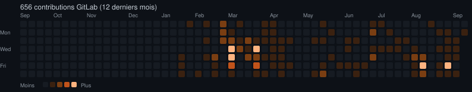

<div align="center">

# Simon Thémiot

### Infrastructure · Cloud · Cybersecurity

**Linux infrastructure, virtualization, networking, security and
self-hosted platforms.**

Building, securing and operating systems from the network layer to the
application stack.

[Website](https://www.stprive.net) · [LinkedIn](https://www.linkedin.com/in/simon-th%C3%A9miot-3733911ba) · [PrivCloud Sharing](https://github.com/Simthem/PrivCloud_Sharing)

</div>

---

## Engineering activity

Most of my day-to-day engineering work is hosted on my
**private GitLab infrastructure**.

The activity below reflects my GitLab contributions over the last
12 months and complements the public activity visible on GitHub.

<!--GITLAB-ACTIVITY:START-->


*601 contributions GitLab ces 12 derniers mois - dernière synchro : 2026-08-31*
<!--GITLAB-ACTIVITY:END-->

---

## About me

I am an IT professional focused on **Linux infrastructure, cloud,
virtualization, networking and cybersecurity**, with professional
experience in IT since 2015.

My background combines systems administration, infrastructure
architecture, security engineering, DevSecOps and software development.

I am largely self-taught and have built my experience by designing,
operating, securing and troubleshooting real production environments.

I particularly enjoy understanding systems end to end: from network
segmentation, routing and storage to virtualization, containers,
reverse proxies, application security, observability and databases.

A significant part of my work runs on private infrastructure and private
GitLab repositories. My public GitHub activity therefore represents only
a portion of the systems, services and projects I maintain.

---

## Areas of expertise

### Infrastructure & Virtualization

- Linux and Debian administration
- Proxmox VE and KVM
- Virtual machine architecture and lifecycle
- NUMA-aware resource allocation
- LVM, RAID and storage architecture
- Docker and containerized services
- Backup and disaster-recovery design
- High-availability and resilient infrastructure
- Capacity planning and performance troubleshooting

### Networking

- TCP/IP and Linux networking
- VLAN segmentation and inter-VLAN architecture
- Routing, NAT and policy-based network design
- Linux bridges and virtual networking
- WireGuard VPN
- iptables / Netfilter
- Reverse proxies and load balancing
- DNS, TLS and PKI fundamentals
- Network troubleshooting and packet-level analysis

### Cybersecurity

- Infrastructure hardening
- Network segmentation and least-privilege architectures
- WAF deployment, tuning and troubleshooting
- Nginx / NAXSI
- ModSecurity
- SafeLine WAF
- Cloudflare WAF
- AWS WAF
- Suricata
- Wazuh
- Vulnerability and dependency scanning
- TLS certificate and trust-chain management
- Secure authentication and access-control design
- Security monitoring and incident investigation

### DevOps & DevSecOps

- GitLab CI/CD
- Docker build pipelines
- Dependency and container security scanning
- Snyk
- Trivy
- Infrastructure automation
- Ansible
- Terraform
- Production deployment workflows
- Logging, monitoring and incident analysis
- Reproducible infrastructure and documentation

### Platforms & Services

- Nextcloud
- Collabora Online
- Nextcloud Talk
- GitLab
- Nginx
- HAProxy
- PostgreSQL
- MariaDB
- S3-compatible object storage
- Zabbix
- Grafana
- Mail infrastructure
- WebDAV
- DNS and reverse-proxy infrastructure

### Development

```text
TypeScript / JavaScript    Next.js · NestJS · Node.js
Python                     Automation · tooling · backend
Shell                      Linux administration · deployment
SQL                        PostgreSQL · MariaDB
C                          Systems and low-level projects
PHP                        Symfony · Laravel
```